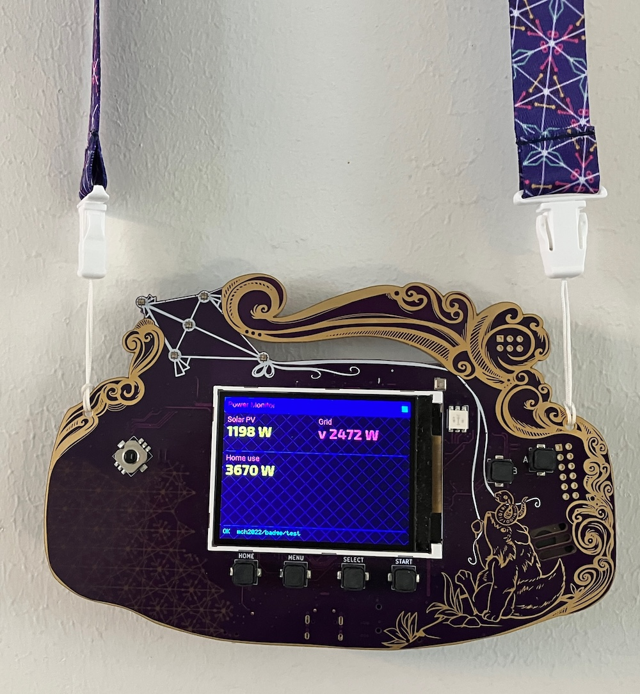

# MCH2022 Badge — Power Monitor

A MicroPython app for the [MCH2022 badge](https://badge.team/docs/badges/mch2022/) that displays live solar PV output, grid flow, and home consumption by subscribing to an MQTT topic.



## What it does

- Connects to WiFi (credentials stored in badge settings, not in code)
- Subscribes to an MQTT topic and parses JSON payloads
- Renders three values on the 320×240 display: **Solar PV**, **Grid** (import ↓ / export ↑), and **Home use** (calculated)
- Press HOME button to exit back to the badge launcher

## MQTT payload format

```json
{"pv": 1800, "cons": 400, "prod": 0}
```

| Key | Unit | Meaning |
|-----|------|---------|
| `pv` | W | Solar panel output |
| `cons` | W | Power drawn from the grid |
| `prod` | W | Power exported to the grid |

Home use is derived: `home = pv + cons - prod`

## Hardcoded values

These are at the top of [`__init__.py`](__init__.py) and must be changed to match your setup:

| Constant | Current value | What to change |
|----------|--------------|----------------|
| `MQTT_BROKER` | `dockerpi.griddlejuiz.com` | Your MQTT broker hostname/IP |
| `MQTT_PORT` | `1883` | Broker port (use 8883 for TLS) |
| `MQTT_TOPIC` | `mch2022/badge/test` | Topic your HA automation publishes to |
| `MQTT_CLIENT_ID` | `mch2022_badge` | Unique client ID on the broker |
| `MQTT_USER` / `MQTT_PASSWORD` | `None` | Set if your broker requires auth |
| `RECONNECT_DELAY_S` | `5` | Seconds between reconnect attempts |

WiFi credentials are **not** hardcoded — configure them in the badge's own WiFi settings menu.

## Prerequisites

- MCH2022 badge with MicroPython firmware
- [mch2022-tools](https://github.com/badgeteam/mch2022-tools) (use the updated repo, not the old `mch2022-tools-master`)
- `pyusb` for the push scripts:
  ```sh
  uv pip install pyusb --python $(which python3)
  ```

## Deploy

```sh
# First time: create the app directory on the badge
python3 ../mch2022-tools/filesystem_create_directory.py /internal/apps/python/hamqtt

# Push the app
python3 ../mch2022-tools/filesystem_push.py __init__.py /internal/apps/python/hamqtt/__init__.py

# Reset the badge to pick up the new file
python3 ../mch2022-tools/exit.py
```

The app then appears in the badge's Python app launcher under **hamqtt**.

## Home Assistant integration

Publish power data to the MQTT topic from an HA automation. Payload keys must match exactly: `pv`, `cons`, `prod` (all in Watts as integers).

## Notes

- The badge screen is 320×240. Font names (`exo2_bold22`, `roboto_regular12`, `7x5`) come from the badge firmware; `7x5` is the safe fallback.
- `umqtt.simple` is standard MicroPython — no extra install needed on the badge.
- TLS (port 8883) is not wired up yet; raise an issue if you need it.
